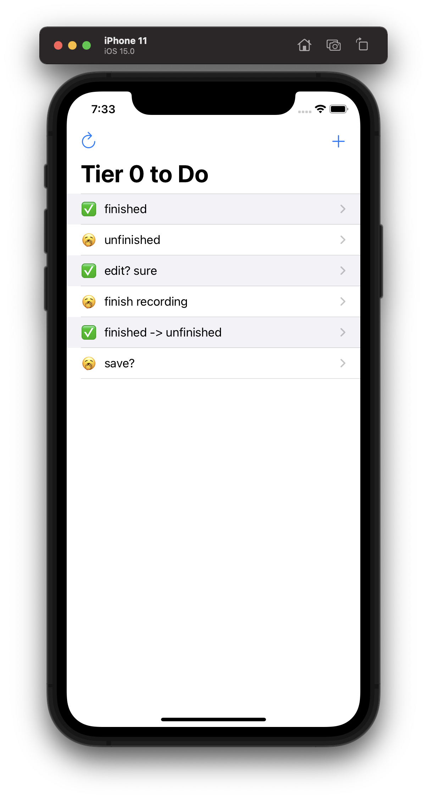
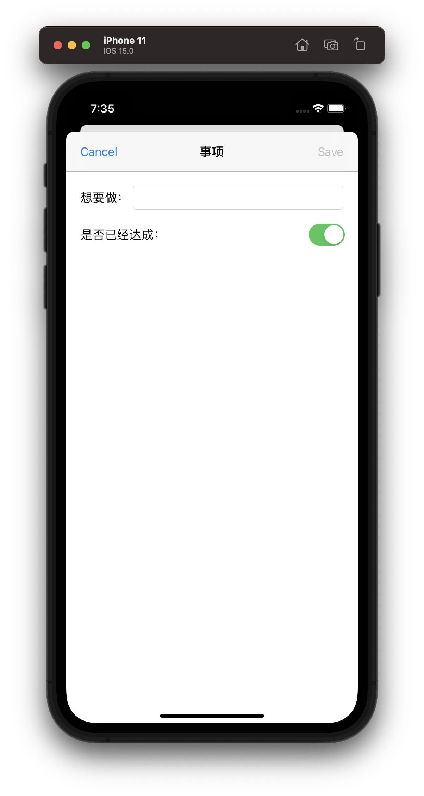
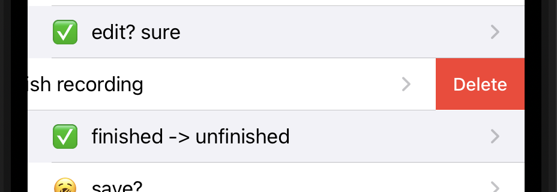
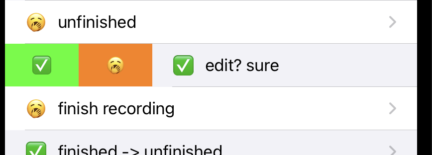
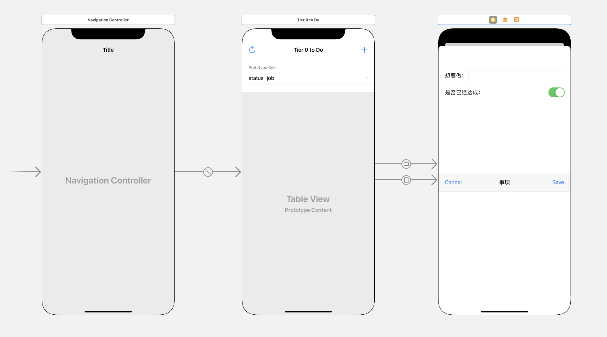
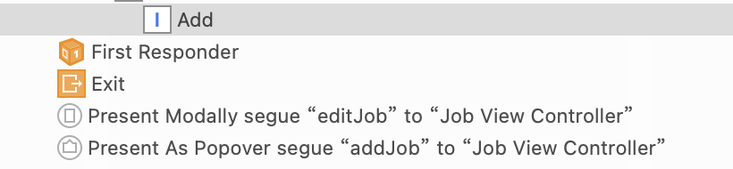
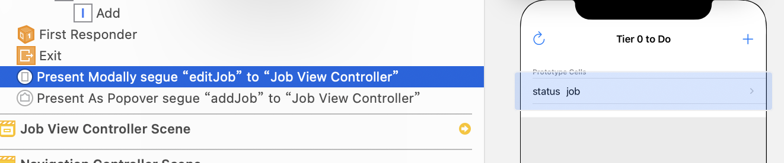
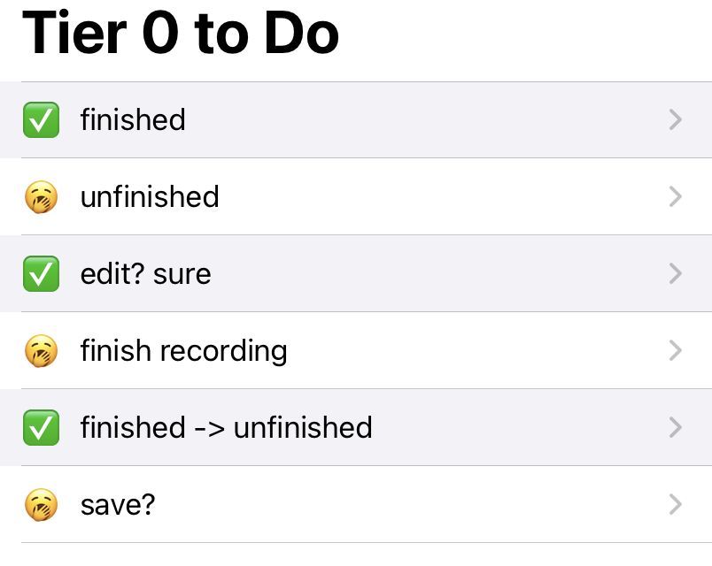
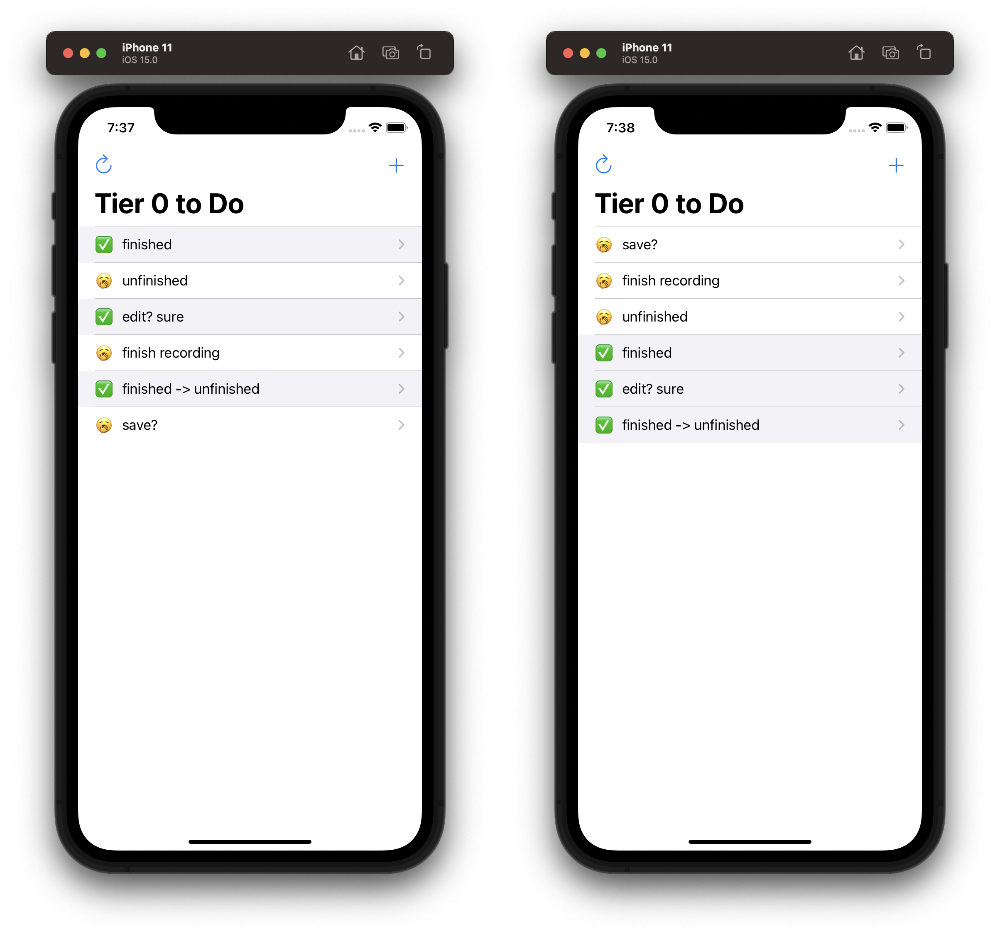

# iw02 杨茂琛 191180164

## 概述

iOS代办事项App开发

## Demo

在线查看Demo演示视频：https://www.bilibili.com/video/BV1bq4y1R7PD/

## 需求

1. 待办事项的添加、修改、删除
2. 以Table视图展示待办事项列表
3. 个性化界面

## 技术细节

### 视图布局

#### TableView 展示待办事项

```
TableView
	TableCell
		label // 事项内容
		label // 完成情况
	Navigation Bar
		left bar button // 排序
		right bar button // 新增
```




#### View 事项编辑

```
View
	Navigation Bar
		left bar button // 取消
		right bar button // 保存
	titleStack
		label // 引导文字
		textField // 事项内容
	finishStack
		label // 引导文字
		switch // 完成情况
```



### 事项的存储

定义了类`JobToDo`包含两个成员：

- `title: String`表示事项的描述
- `isFinished: Bool`表示事项的完成情况

在`T0DoTableViewController`中定义数组`jobs`存储所有的事项，并实现两个方法以从`json`读取事项或保存事项：

```swift
    func saveAll() {
        do {
            let data = try JSONEncoder().encode(jobs)
            try data.write(to: dataFilePath(), options: .atomic)
        } catch {
            print("Unable to save: \(error.localizedDescription)")
        }
    }
    
    func loadAll() {
        if let data = try? Data(contentsOf: dataFilePath()) {
            do {
                jobs = try JSONDecoder().decode([JobToDo].self, from: data)
            } catch {
                print("Error loading from: \(error.localizedDescription)")
            }
        }
    }
```

在类`T0DoTableViewController`的初始化视图方法`viewDidLoad`中调用自己的`loadAll`方法，以实现读取

在类`SceneDelegate`的`sceneDidDisconnect`和`sceneDidEnterBackground`两方法中调用`T0DoTableViewController`的`saveAll`方法，以实现保存

### TableCell左右滑动

#### 左滑以删除



覆盖`editingStyle`即自动允许左滑，在左滑中实现对`jobs`的内容的修改并即时更新TableView

```
    // Override to support editing the table view.
    override func tableView(_ tableView: UITableView, commit editingStyle: UITableViewCell.EditingStyle, forRowAt indexPath: IndexPath) {
        jobs.remove(at: indexPath.row)
        self.tableView.deleteRows(at: [indexPath], with: .automatic)
    }
```

#### 右滑标为完成或未完成



覆盖`leadingSwipeActionsConfigurationForRowAt`即自动允许右滑，方法返回一个`UISwipeActionsConfiguration`其实就是一个actions的数组

实现两个方法`finishAction`、`unfinishAction`将事项标记为完成、未完成，**不会考虑事项原先的状态，不会触发事项排序**

*此处有个问题是，右滑我总感觉没有左滑那么自然、流畅*

ViewController中没有刻意禁止右滑到底，右滑到底将触发第1个action即`finishAction`

```swift
    override func tableView(_ tableView: UITableView, leadingSwipeActionsConfigurationForRowAt indexPath: IndexPath) -> UISwipeActionsConfiguration? {
        let finishAction = UIContextualAction(style: .normal, title: "✅") { (action, view, completionHandler) in
            self.jobs[indexPath.row].isFinished = true
            completionHandler(true)
            self.tableView.reloadData()
        }
        finishAction.backgroundColor = .green
        let unfinishAction = UIContextualAction(style: .normal, title: "🥱") { (action, view, completionHandler) in
            self.jobs[indexPath.row].isFinished = false
            completionHandler(true)
            self.tableView.reloadData()
        }
        unfinishAction.backgroundColor = .orange
        return UISwipeActionsConfiguration(actions: [finishAction, unfinishAction])
    }
```

### 视图

主要有两个视图：事项浏览、事项编辑



#### 视图转换

##### 从`TableView`到`JobView`有两种方式：

1. 点击加号



给这个segue action命名为`addJob`,`JobView`将会根据收到的不同identifier的segue做出不同的响应。

此处响应为添加0个或1个新事项到`jobs`中

2. 点击任一事项



同样地，将这个action命名为`editJob`

`JobView`会取得该事项（以一个`JobToDo`类的形式），对其进行修改。返回TableView时会自动刷新视图，不需要手动刷新

##### 从`JobView`到`TableView`仅一种方式：

`TableView`:

```swift
    @IBAction func unwindToT0Do(segue: UIStoryboardSegue) {
        print("Back to T0Do")
    }
```

`JobView`:

```swift
    @IBAction func CancelTouched(_ sender: UIBarButtonItem) {
        self.performSegue(withIdentifier: "backToT0Do", sender: nil)
    }
    
    @IBAction func SaveTouched(_ sender: UIBarButtonItem) {
        if jobToEdit != nil {
            self.editJobDelegate?.editJob(job: JobToDo(title: titleInput.text!, isFinished: finishSwitch.isOn), jobIndex: jobToEditIndex!)
        }
        else {
            self.addJobDelegate?.addJob(job: JobToDo(title: titleInput.text!, isFinished: finishSwitch.isOn))
        }
        self.performSegue(withIdentifier: "backToT0Do", sender: nil)
    }

}
```

用一个`performSegue`的方法返回视图

#### 视图间沟通

两个视图（或者说两个类）之间需要在某些时候共享一些内容，此处通过协议`protocol`实现

在`T0DoTableViewController`中实现好了`editJob` `addJob` 两方法

在`JobViewController`中使用两协议来调用两方法：

```swift
protocol AddJobDelegate {
    func addJob(job: JobToDo)
}

protocol EditJobDelegate {
    func editJob(job: JobToDo, jobIndex: Int)
}
```


### 背景色强调

通过给已完成的任务设定浅灰色（系统6号灰色），在视觉上强调未完成的任务



通过在返回`UITableViewCell`时对已完成的任务进行定制实现：

```swift
    override func tableView(_ tableView: UITableView, cellForRowAt indexPath: IndexPath) -> UITableViewCell {
        let cell = tableView.dequeueReusableCell(withIdentifier: "T0DoCell", for: indexPath) as! T0DoTableViewCell
        let job = jobs[indexPath.row]
        cell.status.text! = job.isFinished ? "✅" : "🥱"
        cell.job.text! = job.title
        cell.backgroundColor = job.isFinished ? .systemGray6 : .none
        return cell
    }
```

### 事项排序

TableView的左上角的`Refresh`将事项按照完成情况进行**不稳定**的排序（因为在该App中，事项没有截止时间这一概念）。



在button被按下后，对`jobs`进行排序并刷新显示：

```swift
    @IBAction func refreshTouched(_ sender: Any) {
        jobs.sort { (joba, jobb) -> Bool in
            return joba.isFinished == false
        }
        self.tableView.reloadData()
    }
```

